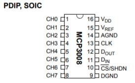

#Solar Tracker - Analog Read (MCP3008)
@(Raspberry Pi)[Solar Tracker |Analog Read | MCP3008]
**<font color="Blue">[2018/04/15]<font> **
**<font color="Blue">Author: ET <font> **

> In order to build the **Solar Tracker**, I want to built it by the Raspberry Pi. First, I need to use the **Photo Resistance** to detect where the light source but the Raspberry Pi don't have the Analogue-to-digital converter(ADC). After that I found the MCP3008 which has 8 channel and  10-bits resolution. This IC interface SPI can connect with the Raspberry Pi.
> 
> SPI Interface
> 
> ref. http://wiki.csie.ncku.edu.tw/embedded/SPI


#### [MCP3008]
#####Package Type

ref. https://cdn-shop.adafruit.com/datasheets/MCP3008.pdf

#####Pin Information

- **CH0-7** : Analog Input
- **VDD** : Operating Volatge 2.7~5.5 V
- **VREF** : VREF = VDD
- **AGND** : Analog Ground
- **CLK** : SPI CLK Pin
- **DOUT** : SPI Serial data output
- **DIN** : SPI port serial data input used to load channel configuration
- **CS/SHDN** : Must be high volts between conversion
- **DGND** : Digital Ground

The first clock received with CS low and DIN high will
constitute a start bit.

#####Circuit Diagram

#####Code block
``` python
import RPi.GPIO as GPIO
import time

ch_num=4

cs_pin=29
clk_pin=31
mosi_pin=33
miso_pin=35		#Data in

t_SUCS=100e-9
t_SU=50e-9


GPIO.setmode(GPIO.BOARD)
GPIO.setup(cs_pin,GPIO.OUT)
GPIO.setup(clk_pin,GPIO.OUT)
GPIO.setup(mosi_pin,GPIO.OUT)
GPIO.setup(miso_pin,GPIO.IN)

'''
if (ch_num>7 || ch_num<1)
	print("The channel must be 0 < ch_num < 8")
	break
'''
try:
        while True:
                
                GPIO.output(cs_pin,GPIO.HIGH)
                GPIO.output(clk_pin,GPIO.LOW)
                GPIO.output(cs_pin,GPIO.LOW)

                for i in range(0,5,1):
                        GPIO.output(clk_pin,GPIO.HIGH)
                        GPIO.output(clk_pin,GPIO.LOW)
                        
                        GPIO.output(mosi_pin,GPIO.HIGH)   #start
                        GPIO.output(mosi_pin,GPIO.HIGH)   #SGL/DIFF
                        GPIO.output(mosi_pin,GPIO.LOW)    #0,0,0 Channel0
                        GPIO.output(mosi_pin,GPIO.LOW)
                        GPIO.output(mosi_pin,GPIO.LOW)
                
                for j in range(0,12,1):
                        GPIO.output(clk_pin,GPIO.HIGH)
                        GPIO.output(clk_pin,GPIO.LOW)
                        
                        adcout=GPIO.input(miso_pin)
                

                GPIO.output(cs_pin,GPIO.HIGH)
except:
        GPIO.cleanup()
```